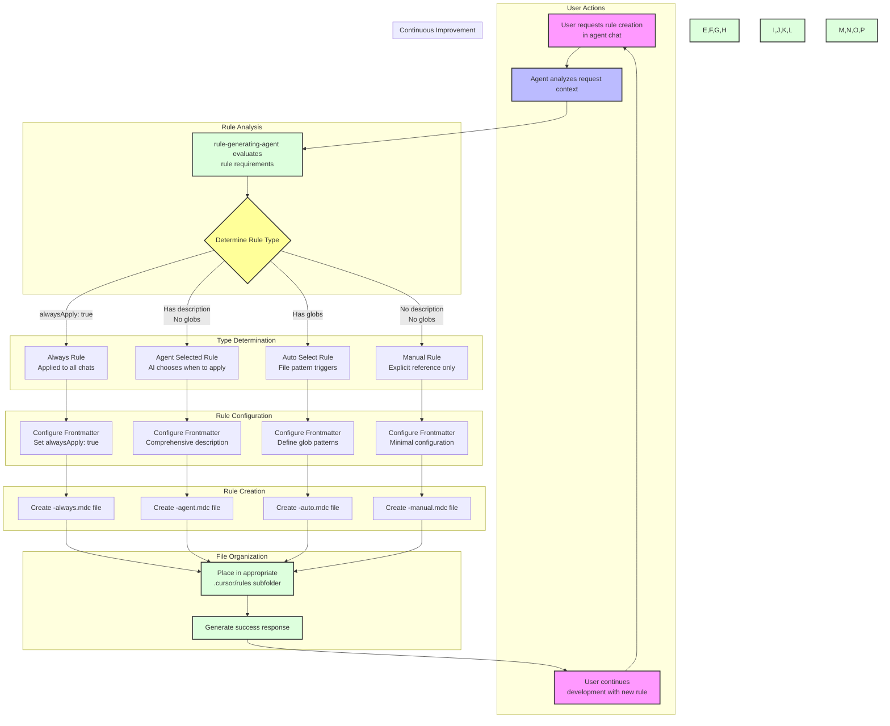

<document>
<document-metadata>
## How Rule Generation Works

> [!CAUTION]
> This is an excerpt from bmadcode/cursor-custom-agents-rules-generator. Experimentating with breaking up these primitive high level concepts in small md files to use as context for refactoring and measuring rules going forward.
</document-metadata>

<table-of-contents>
- [Process Overview](#process-overview)
- [Example Rule Generation Prompts](#example-rule-generation-prompts)
- [Rule Types](#rule-types)
- [Private Rules and Configuration](#private-rules-mcp-config-and-custom-agents)
- [Custom Agent Generation](#custom-agent-generation)
- [Best Practices](#best-practices)
- [Files Excluded from Indexing](#files-excluded-from-indexing)
</table-of-contents>

<section-process-overview>
## Process Overview

The rule generation process in Cursor follows a sophisticated workflow that determines how rules are created, categorized, and applied. This process ensures consistent rule creation and proper configuration of rule types based on their intended usage.

<!-- Visual representation of the rule generation workflow -->


### Key Process Steps

1. **Request Analysis**
   - Agent receives and analyzes the user's request
   - Identifies key requirements and intended behavior

2. **Type Determination**
   - Always Rule: When rule should apply to every interaction
   - Agent Selected Rule: When AI should decide based on context
   - Auto Select Rule: When specific file patterns should trigger the rule
   - Manual Rule: When explicit user reference is required

3. **Frontmatter Configuration**
   - `description`: Comprehensive for agent-selected rules
   - `globs`: File patterns for auto-select rules
   - `alwaysApply`: True for always-active rules
   - Combinations possible for enhanced functionality

4. **File Creation and Organization**
   - Creates .mdc file with appropriate suffix
   - Places in correct .cursor/rules subfolder
   - Follows naming conventions
   - Generates success response with rule details

This workflow ensures consistent rule creation and proper configuration based on intended usage, while maintaining an organized rule structure within the project.
</section-process-overview>

<section-examples>
## Example Rule Generation Prompts

The beauty of Cursor's rule generation system is that you don't need to explicitly request rule creation - simply describe the desired behavior or requirement. The AI will determine the appropriate rule type and structure based on your description.

### Always Rule Examples
These become global rules that apply to every interaction:

```markdown
"Ensure all communication maintains a professional tone while incorporating appropriate emojis"
-> Creates: .cursor/rules/global-rules/communication-style-always.mdc

"Format all error messages with a consistent structure: [ErrorType] Message (ErrorCode)"
-> Creates: .cursor/rules/global-rules/error-format-always.mdc
```

### Agent Selected Rule Examples
For context-dependent behaviors that the AI should intelligently apply:

```markdown
"When working with database operations, always include transaction management and proper error handling"
-> Creates: .cursor/rules/core-rules/database-safety-agent.mdc

"For security-related code changes, enforce OWASP best practices and require explicit security review comments"
-> Creates: .cursor/rules/core-rules/security-standards-agent.mdc
```

### Auto Select Rule Examples
For file pattern-specific rules, optionally with AI guidance:

```markdown
"TypeScript files should use explicit return types and parameter types"
-> Creates: .cursor/rules/ts-rules/typescript-types-auto.mdc
(Uses globs: *.ts, *.tsx)

"React components must include proper prop types and documentation"
-> Creates: .cursor/rules/ts-rules/react-component-standards-auto.mdc
(Uses globs: src/components/**/*.tsx, src/components/**/*.ts)
```

### Combined Description and Globs Examples
Demonstrating how rules can use both pattern matching and AI selection:

```markdown
"Ensure Jest test files follow the AAA pattern (Arrange-Act-Assert) and include comprehensive error cases"
-> Creates: .cursor/rules/testing-rules/jest-standards-auto.mdc
(Uses both description for guidance and globs: **/*.test.ts, **/*.spec.ts)

"GraphQL resolvers must implement proper error handling and include performance considerations"
-> Creates: .cursor/rules/ts-rules/graphql-resolver-standards-auto.mdc
(Uses both description and globs: src/resolvers/**/*.ts)
```

### Manual Rule Examples
For specialized rules that should only be explicitly invoked:

```markdown
"Create a rule for temporary debugging patterns that I can reference when needed"
-> Creates: .cursor/rules/tool-rules/debug-patterns-manual.mdc

"I need a reference guide for complex regex patterns that I can call upon"
-> Creates: .cursor/rules/tool-rules/regex-patterns-manual.mdc
```

### Learning from Mistakes
Including specific examples where rules were created to prevent previous issues:

```markdown
"I asked you to set up Jest for our project and you created a JestConfig.js file, yet this is a TypeScript only project. Never again create any JS files. Always use TypeScript or JSON if necessary."
-> Creates: .cursor/rules/ts-rules/typescript-only-agent.mdc
(Includes the specific mistake in examples)

"The API endpoints you generated didn't include proper validation. Always include comprehensive input validation for all API endpoints."
-> Creates: .cursor/rules/ts-rules/api-validation-agent.mdc
(Documents the validation oversight in examples)
```

### Rule Evolution Examples
Showing how rules can be updated or consolidated:

```markdown
"Combine all the TypeScript formatting rules into a single comprehensive standard"
-> Updates/Consolidates multiple rules into: .cursor/rules/ts-rules/typescript-standards-auto.mdc

"Update the testing coverage requirement to 90% and add specific rules for integration tests"
-> Updates existing rule with new requirements
```

The AI automatically handles all aspects of rule creation:

1. Analyzes the request to determine the appropriate rule type
2. Creates or updates the rule file with proper frontmatter
3. Places it in the correct organizational folder
4. Includes relevant examples and invalid cases
5. Maintains proper formatting and structure
6. Generates appropriate success response

Remember: The more specific and contextual your request, the better the AI can create appropriate rules that match your needs. Including examples of what you want to prevent (based on past mistakes) helps create more effective rules. 🎯
</section-examples>

<section-rule-types>
## Rule Types

The rule system in Cursor is built around four primary rule types, each with specific activation conditions and use cases. Understanding how the frontmatter fields (`description`, `globs`, and `alwaysApply`) interact is crucial for effective rule creation.

### Rule Type Overview

| Rule Type | File Suffix | description | globs | alwaysApply | Primary Usage |
|-----------|-------------|-------------|-------|-------------|---------------|
| Always | -always.mdc | Optional | Ignored | true | Global rules that apply to every interaction |
| Agent Selected | -agent.mdc | Required | Blank | false | AI decides when to apply based on context |
| Auto Select | -auto.mdc | Optional | Required | false | Automatically triggered by file patterns |
| Manual | -manual.mdc | Blank | Blank | false | Only applied when explicitly referenced |

### Detailed Behavior

1. **Always Rules** (-always.mdc)
   - Applied to every chat and command interaction
   - `alwaysApply: true` overrides all other fields
   - Description can be included for documentation
   - Glob patterns are ignored even if specified
   - Best for: Global conventions, communication styles, consistent behaviors

2. **Agent Selected Rules** (-agent.mdc)
   - AI determines when to apply based on description
   - Requires comprehensive description field
   - No glob patterns (must be blank)
   - Best for: Context-dependent rules, complex decision patterns

3. **Auto Select Rules** (-auto.mdc)
   - Automatically activated by matching file patterns
   - Requires valid glob patterns
   - Description is optional but recommended
   - Can combine with description for hybrid behavior
   - Best for: Language-specific rules, file type conventions

4. **Manual Rules** (-manual.mdc)
   - Only activated by explicit reference (e.g., @rule-name)
   - Both description and globs must be blank
   - Best for: Specialized or temporary rules

<subsection-field-interactions>
### Field Interactions and Special Cases

1. **Description + Globs Combination**
   - Valid in Auto Select rules
   - Enables both pattern-based activation and AI selection
   - Example: TypeScript standards that apply to .ts files but can also be referenced for planning

2. **Priority Order**
   - Always rules take precedence (if alwaysApply: true)
   - Auto Select rules activate next (if file matches)
   - Agent Selected rules considered based on context
   - Manual rules only on explicit reference
</subsection-field-interactions>

<subsection-examples>
### Examples

<example>
# Always Rule Example (-always.mdc)
---
description: "Optional documentation about the rule's purpose"
globs:
alwaysApply: true
---
# Communication Style Guide
</example>

<example>
# Auto Select Rule with Description (-auto.mdc)
---
description: "Guidelines for TypeScript component structure"
globs: src/components/**/*.tsx, src/components/**/*.ts
alwaysApply: false
---
# TypeScript Component Standards
</example>

<example type="invalid">
# Invalid Configuration
---
description: "Cannot have description in manual rule"
globs: "*.ts" # Quotes not allowed in globs
alwaysApply: true # Conflicts with manual rule type
---
# Invalid Rule Structure
</example>
</subsection-examples>

<subsection-best-practices>
### Best Practices for Rule Type Selection

1. Choose the most specific rule type for your needs
2. Use Always rules sparingly to avoid conflicts
3. Prefer Auto Select for file-specific conventions
4. Use Agent Selected for context-dependent decisions
5. Reserve Manual rules for specialized cases

This type system ensures rules are applied appropriately while maintaining flexibility for different use cases.
</subsection-best-practices>
</section-rule-types>

<section-private-rules>
## Private Rules, Custom Agents, and Configuration

<subsection-private-rules-overview>
### Private Rules Overview

Private rules provide a way to maintain personal or team-specific rules that don't need to be shared with the entire repository. These rules can be stored in your user-specific `.cursor/rules` folder and will be applied across all your projects.
</subsection-private-rules-overview>

<subsection-rules-structure>
#### User-Specific Rules Structure
```
~/.cursor/rules/                    # User's personal rules directory
├── my-rules/                       # Personal customizations
│   ├── formatting-always.mdc       # Personal formatting preferences
│   └── workflow-agent.mdc          # Personal workflow patterns
├── project-rules/                  # Project-specific rules
│   ├── project-a/                  # Rules for specific projects
│   └── project-b/
└── team-rules/                     # Team-specific rules
    └── team-standards-auto.mdc     # Team conventions
```
</subsection-rules-structure>

<subsection-benefits>
#### Benefits of Private Rules
- Apply consistently across all projects you open
- Maintain personal preferences without affecting team repository
- Test rules before proposing them to the team
- Keep project-specific customizations separate
- Override repository rules when needed
</subsection-benefits>

<subsection-custom-agents-config>
### Custom Agents Configuration

Custom agents provide fine-grained control over AI behavior and capabilities. They can be configured with specific tools, models, and prompts to create specialized assistants for different tasks.

#### Agent Configuration Components
1. **Tool Access**
   - Control which Cursor native tools are available
   - Manage MCP tool accessibility
   - Set tool-specific parameters and limits

2. **Model Selection**
   - Choose appropriate AI models for specific tasks
   - Configure model parameters
   - Set context window sizes

3. **Custom Prompts**
   - Define specialized behavior patterns
   - Set task-specific guidelines
   - Include role-specific knowledge

#### Agent Types and Roles
```json
{
  "agents": {
    "projectManager": {
      "model": "gpt-4",
      "role": "Project Management",
      "allowedTools": ["git", "project_planning"],
      "customRules": ["pm-workflow-agent.mdc"]
    },
    "architect": {
      "model": "gpt-4",
      "role": "System Architecture",
      "allowedTools": ["codebase_search", "diagram_generation"],
      "customRules": ["architecture-standards-agent.mdc"]
    },
    "developer": {
      "model": "gpt-4",
      "role": "Development",
      "allowedTools": ["all"],
      "customRules": ["coding-standards-auto.mdc"]
    }
  }
}
```

### MCP Integration

MCP (Model Control Protocol) configuration can be customized at both the user and project level, allowing for sophisticated integration with custom agents and rules.

#### MCP Configuration Structure
```json
{
  "mcp": {
    "tools": {
      "enabled": ["codebase_search", "edit_file", "run_terminal_cmd"],
      "disabled": [],
      "custom": {
        "myCustomTool": {
          "description": "Custom tool configuration",
          "parameters": {}
        }
      }
    },
    "agents": {
      "customAgents": true,
      "agentConfigPath": "~/.cursor/agents.json"
    }
  }
}
```

#### Integration Points
1. **Tool Configuration**
   - Enable/disable specific tools
   - Configure tool parameters
   - Add custom tools

2. **Agent Integration**
   - Link agents to specific tools
   - Set agent-specific configurations
   - Manage agent permissions

3. **Rule Application**
   - Configure rule priority
   - Set rule activation conditions
   - Manage rule conflicts

### Future Compatibility

As Cursor evolves, the configuration system will be enhanced with new features:

1. **Upcoming Features**
   - Official `agents.json` configuration file
   - Enhanced agent customization options
   - Improved rule management system

2. **Migration Path**
   - Current configurations will be automatically migrated
   - Backward compatibility will be maintained
   - New features will be opt-in

3. **Best Practices**
   - Keep configurations version controlled
   - Document custom configurations
   - Plan for future migrations

### Configuration Tips

1. **Organization**
   - Use clear folder structures
   - Maintain consistent naming conventions
   - Document configuration decisions

2. **Version Control**
   - Track configuration changes
   - Use `.gitignore` for private configs
   - Share team configurations appropriately

3. **Maintenance**
   - Regular configuration reviews
   - Update as new features become available
   - Remove unused configurations

Remember: Private rules and custom agents provide powerful ways to tailor Cursor's behavior to your specific needs while maintaining clean separation between personal, team, and project-specific configurations. 🔧
</subsection-custom-agents-config>
</section-private-rules>

<section-custom-agents>
## Custom Agent Generation

<subsection-overview>
Custom Agents allow scoping and guidance to what an agent can and cannot do, more directly than using cursor rules files. With a custom agent, you can specify what tools the agent can and cannot use (both cursor native and mcp), and more importantly you can control what model it uses and give it a custom prompt to guide how it operates. This is like a direct injection of a clear always rule for this specific type of agent you have created. When combined with the Agile workflow, you can have a dedicated Project Manager Agent, an Architect Agent, Designer and UX Expert Agents, Front End, Back End, and Language Specific Expert Developers and keep them all focused on what they are good at, and providing them real guardrails.
</subsection-overview>

<subsection-future-updates>
Cursor in an upcoming update will allow the creation and maintainability of these in a JSON file - in the meantime, these have to be created manually 1 by one in a gui that is a bit flaky and the text entry are is very small.
</subsection-future-updates>

So I have come up with a file format to store all the information of my custom agents - which not currently used by cursor, it is an easy way to configure all of their options and define their custom prompts in a text editor - and then input or update via the GUI.

You can see in the samples a star-trek-agents.md file - which is a themed fun take on the various roles or agents I might need that I used chatGPT to create and brain storm on. I then use a template and custom rule to transform that file to what becomes modes.json. For the sample, I took that output and saved it instead as star-trek-agents-modes.json in the samples folder. The modes.json file under .cursor is a more practical approach to some agents you can make that will work great with the agile workflow method.

In the future, that modes.json file will be replaced by the official file format from cursor, at which time this repo will be updated with the new convention.
</section-custom-agents>

<section-best-practices>
## Best Practices

### Rule Creation and Management

#### Initial Rule Development
- Let the AI handle rule creation and updates through natural language requests
- Be specific about desired behaviors and include context
- Provide examples of both good and bad patterns
- Start with minimal rules and let them evolve organically
- Consider the scope and impact of each rule before creation

#### Rule Organization
- Keep rules modular and focused on specific concerns
- Use appropriate organizational folders (e.g., `ts-rules`, `core-rules`)
- Follow consistent naming patterns: `rule-name-{type}.mdc`
- Group related rules logically within their folders
- Consider rule dependencies and interactions

#### Rule Consolidation
- Regularly review rules for overlap or redundancy
- Consolidate rules when multiple small rules cover similar concepts
- Example: Combine multiple TypeScript formatting rules into a single comprehensive standard
- Keep consolidated rules well-organized with clear sections
- Document the reasoning behind consolidation decisions

#### Rule Evolution
- Allow rules to grow with your project's needs
- Update rules based on team feedback and practical usage
- Document significant rule changes in commit messages
- Consider versioning for major rule changes
- Test rule changes with different scenarios

### Effective Rule Usage

#### Rule Selection
- Choose the most specific rule type for your needs
- Use Always rules sparingly to avoid conflicts
- Prefer Auto Select rules for file-specific conventions
- Use Agent Selected rules for context-dependent decisions
- Reserve Manual rules for specialized cases

#### Rule Content
- Write clear, actionable directives
- Include specific examples for complex rules
- Use comments to explain non-obvious decisions
- Keep rules focused and concise
- Include both valid and invalid examples

#### Rule Optimization
- Monitor rule effectiveness over time
- Remove or update rules that cause friction
- Combine rules that are frequently used together
- Split rules that become too complex
- Regular review and refinement of existing rules

### Rule Maintenance

#### When to Remove Rules
- When the codebase naturally follows the pattern
- If the rule creates more friction than value
- When better alternatives emerge
- If the rule conflicts with new project requirements
- When the rule becomes obsolete due to tooling changes

#### When to Update Rules
- When project requirements change
- To incorporate learned best practices
- When new edge cases are discovered
- To improve clarity or effectiveness
- When technical dependencies evolve

#### Rule Review Process
1. Regularly assess rule effectiveness
2. Gather feedback from team members
3. Document rule impact and issues
4. Make iterative improvements
5. Communicate changes to the team

### Common Pitfalls to Avoid

#### Rule Creation
- Creating overly broad or vague rules
- Implementing conflicting rule requirements
- Ignoring rule type best practices
- Creating redundant rules
- Over-relying on Always rules

#### Rule Management
- Neglecting rule maintenance
- Keeping outdated or ineffective rules
- Not documenting rule changes
- Ignoring rule conflicts
- Poor rule **organization**

### Integration with Development Workflow

<section-workflow-integration>
<subsection-custom-agents>
#### Custom Agents and Rules
- Align rules with custom agent capabilities
- Use rules to enhance agent effectiveness
- Consider rule impact on different agent types
- Maintain consistency across agents
- Document agent-specific rule requirements
</subsection-custom-agents>

<subsection-project-evolution>
#### Project Evolution
- Adapt rules as the project grows
- Consider scalability in rule design
- Plan for future rule requirements
- Monitor rule performance at scale
- Regular rule system audits
</subsection-project-evolution>

Remember: The rule system is a living part of your development process. It should evolve and adapt with your project while maintaining clarity and effectiveness. Regular review and refinement ensure your rules continue to add value without creating unnecessary complexity. 🎯
</section-workflow-integration>
</section-best-practices>

<section-file-exclusions>
## Files Excluded from Indexing

The `.cursorindexingignore` feature allows certain files to be accessible but excluded from indexing:

- Templates moved to `.cursor/templates` folder
- Included in `.cursorindexingignore` but not in `.cursorignore`
- XNotes remains in `.cursorignore` (files that need to move elsewhere to be used)
</section-file-exclusions>

</document>
