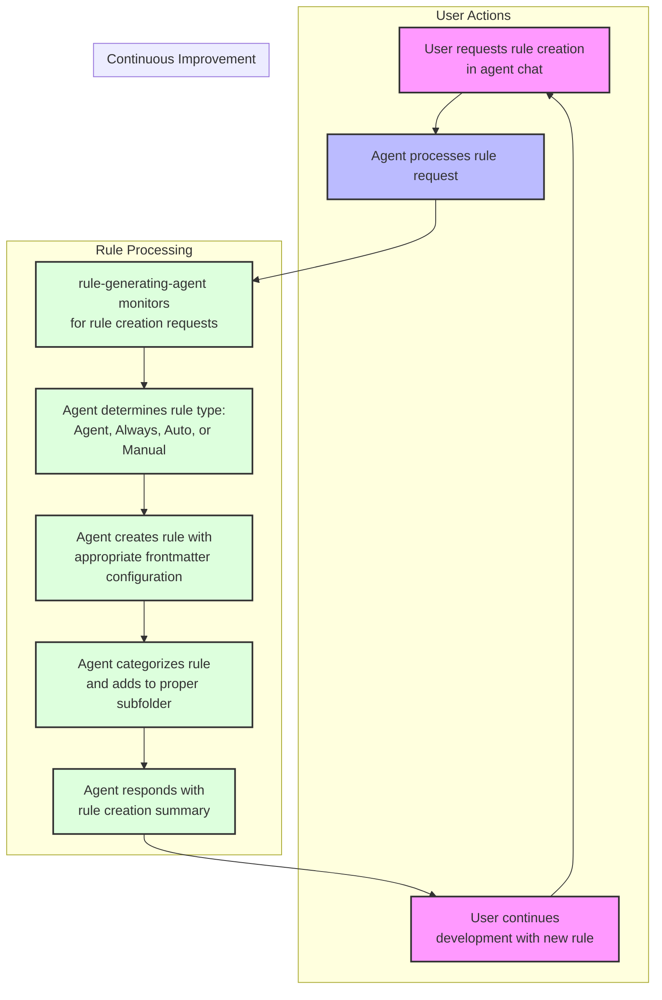

## How Rule Generation Works

> [!CAUTION]
> This is an excerpt from bmadcode/cursor-custom-agents-rules-generator. Experimentating with breaking up these primitive high level concepts in small md files to use as context for refactoring and measuring rules going forward.

## Example Rule Generation Prompts

No need to explicitly say "create a rule" - just describe the desired behavior:

- "Create a typescript file commenting standard that balances thoroughness with brevity"
- "Please create an agent rule so that whenever I request deep research specifically on a topic you will first always inject the system date time into the context and use the Tavily search MCP tool to improve the results."
- "Never create JS files again, you will only create TS or JSON files!" or "I asked you to set up Jest for our project and you created a JestConfig.js file, yet this is a TypeScript only project. Never again create any JS files. Always use TypeScript or JSON if necessary." - the second version of this request will ensure that the rule examples includes this specific call out, helping the agent learn better from actual mistakes made.
- "Ensure proper error handling in all TypeScript files"
- "Talk like a pirate in communications but not in code or documentation"
- "Update testing standards to require 80% coverage"
- "Enforce consistent naming conventions in my code"
- "Standardize documentation formats"
- "Keep imports organized in groups alphabetically in TypeScript files"

The AI automatically:

1. Creates/updates the rule file
2. Places it in the correct location
3. Follows formatting standards
4. Maintains version control

## Rule Types

| Rule Type        | Usage                                            | description Field | globs Field           | alwaysApply field |
| ---------------- | ------------------------------------------------ | ----------------- | --------------------- | ----------------- |
| Agent Selected   | Agent sees description and chooses when to apply | critical          | blank                 | false             |
| Always           | Applied to every chat and cmd-k request          | blank             | blank                 | true              |
| Auto Select      | Applied to matching existing files               | blank             | critical glob pattern | false             |
| Auto Select+desc | Better for new files                             | included          | critical glob pattern | false             |
| Manual           | User must reference in chat                      | blank             | blank                 | false             |

## Private Rules, MCP Config and Custom Agents.

If you want to have rules that are not used by others in the repository - you can add rules to a .cursor/rules folder in your user folder. They will also be applied to every project you open, which is a potential benefit. Additionally you can use custom agents with their own rules, that are not shared. In the future when Cursor adds the ability to have a agents.json file (or similarly named) - then you should still be able to add it to the user folder .cursor folder. This also works with mcp.json.

## Custom Agent Generation

Custom Agents allow scoping and guidance to what an agent can and cannot do, more directly than using cursor rules files. With a custom agent, you can specify what tools the agent can and cannot use (both cursor native and mcp), and more importantly you can control what model it uses and give it a custom prompt to guide how it operates. This is like a direct injection of a clear always rule for this specific type of agent you have created. When combined with the Agile workflow, you can have a dedicated Project Manager Agent, an Architect Agent, Designer and UX Expert Agents, Front End, Back End, and Language Specific Expert Developers and keep them all focused on what they are good at, and providing them real guardrails.

Cursor in an upcoming update will allow the creation and maintainability of these in a JSON file - in the meantime, these have to be created manually 1 by one in a gui that is a bit flaky and the text entry are is very small.

So I have come up with a file format to store all the information of my custom agents - which not currently used by cursor, it is an easy way to configure all of their options and define their custom prompts in a text editor - and then input or update via the GUI.

You can see in the samples a star-trek-agents.md file - which is a themed fun take on the various roles or agents I might need that I used chatGPT to create and brain storm on. I then use a template and custom rule to transform that file to what becomes modes.json. For the sample, I took that output and saved it instead as star-trek-agents-modes.json in the samples folder. The modes.json file under .cursor is a more practical approach to some agents you can make that will work great with the agile workflow method.

In the future, that modes.json file will be replaced by the official file format from cursor, at which time this repo will be updated with the new convention.

## Best Practices

### Rule Creation

- Let AI handle rule creation and updates - but if you find stuff that is excessive or redundant, dont be afraid to prune the rules to help get them down to their core utility and essence
- Be specific about desired behaviors
- Provide examples of good/bad patterns
- For new projects, allow organic rule emergence and try to have overall less rules, and rely more also on custom instructions for your custom agents.
- If you start to have many very small rules applied to the same concept - for example you see your typescript rules subfolder has many files - you can ask the agent to consolidate and condense them down to a single file if they all generally apply and get picked up by the agent at the same time.

### AI Behavior Control

- Create rules when noticing inconsistent behavior
- Use clear, descriptive language
- Verify AI understanding by reviewing rules

### Workflow Integration

- Start with template rules
- Let AI evolve rules as your project grows
- Maintain consistency using AI for rule management

### Rule Removal

- Some rules become unnecessary as codebase grows as the AI will follow surrounding code styles and conventions
- The minimal amount of rules, the better - so prune rules as the codebase changes or models improve
- A rule you need today, may be a rule you do not need tomorrow, and then again you might need it another day - trial and error and evolution is the key to dealing with the nondeterministic nature of what we are working with here.

## Files Excluded from Indexing

The `.cursorindexingignore` feature allows certain files to be accessible but excluded from indexing:

- Templates moved to `.cursor/templates` folder
- Included in `.cursorindexingignore` but not in `.cursorignore`
- XNotes remains in `.cursorignore` (files that need to move elsewhere to be used)
